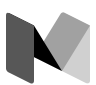

# NEW ARKET

#### Магазин будет состоять из следующих страниц (для покупателя):
* Стартовая страница (ГЛАВНАЯ)
  * Поиск
  * 
* Страница фильтрации и поиска (КАТАЛОГ)
  * Поиск
  * Разделение по классам
  * Разделение по характеристикам
  * Разделение по цене
* Продукт
  * Фотографии
  * Название
  * Цена
  * Описание
  * Характеристики
* Корзина (КОРЗИНА)
  * Удалить продукт
  * Добавить или убрать один экземпляр продукта
  * Итог
* Личный кабинет (ПРОФИЛЬ)
  * Редактировать профиль
  * Мои заказы
  * Избранные
  * Списки сравнения
  * Отзывы
  * ВЫХОД
 ---
#### Магазин будет состоять из следующих страниц (для продавцов):
* Стартовая страница (НОВЫЙ ПРОДУКТ)
  * Поля для ввода параметров 
* Список продукции (КАТАЛОГ МАГАЗИНА)
  * Список из продуктов
  * Редактировать продукт (По паролю)
    * Редактировать описание
    * Редактировать характеристики
    * Редактировать цену
    * Удалить продукт
* Личный кабинет 
  * Редактировать личную информацию магазина
---
#### Магазин будет состоять из следующих страниц (для админа):
* Из поиска пользователей или покупателей, которых следует найти из базы
  * Найдя продавца или пользователя можно посмотреть его личную информацию. 
  * Найдя продавца его можно удалить
  * Можно найти пользователя и сделать:
    * сделать его продавцом
    * удаление пользователя
  * Найти продукт и его удалить